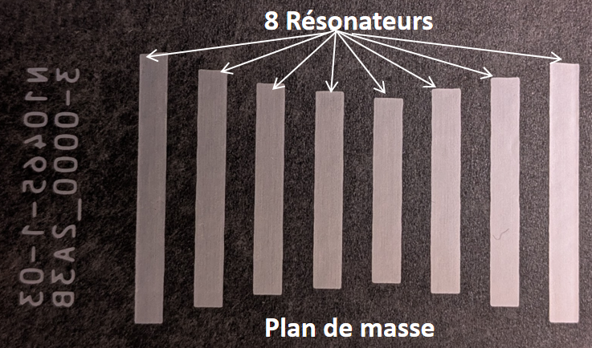
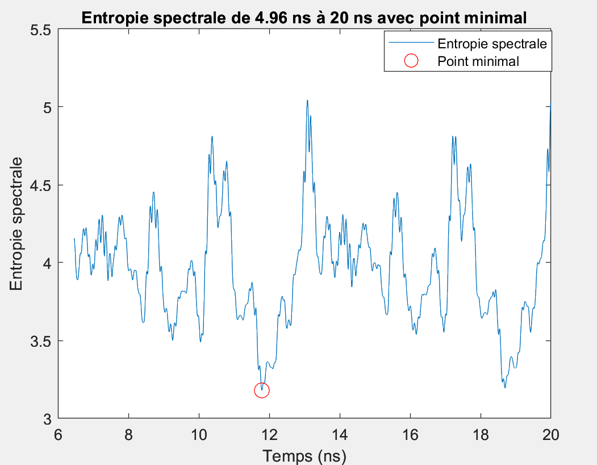
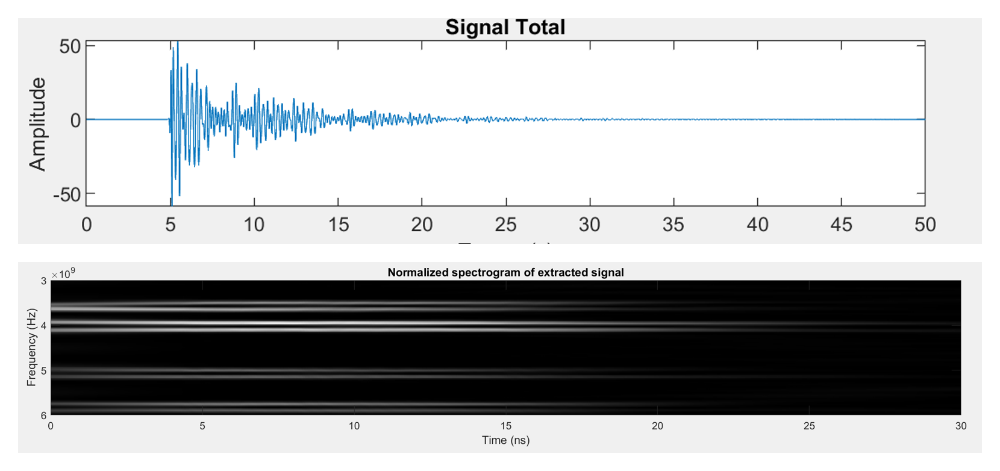
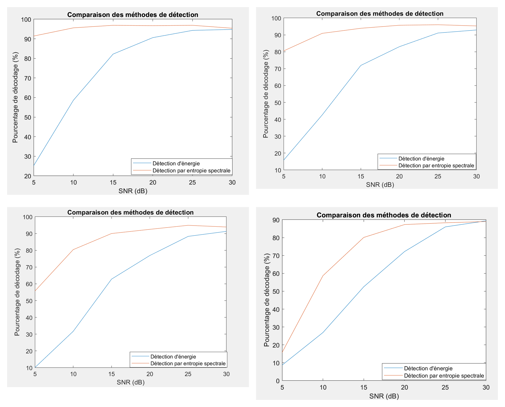

Chipless RFID Detection & Decoding in an Embedded RF Environment

## Overview

This research project investigates **robust detection and decoding of chipless RFID tags in realistic RF environments**.

Chipless RFID tags encode information through their electromagnetic resonances rather than through an integrated electronic chip. In ideal conditions, the resonant peaks can be identified directly from the frequency response. In real environments, however, reflections, interference, noise, and the quasi-optical response of the tag structure can overlap with the useful tag signature and lead to decoding errors.

The work therefore focuses on automatically identifying the useful part of the received signal before decoding the tag.

The project compares:

- a **classical energy-based detection method**;
- a new **spectral-entropy-based detection method** for adaptive estimation of the signal extraction instant `Tstart`.

The objective is to improve decoding robustness under noisy and reflective conditions.

---

## Research Context

The work was carried out in the context of:

- **LCIS – Laboratoire de Conception et d'Intégration des Systèmes**
- **Grenoble INP / Université Grenoble Alpes**
- **IDYLICC Technology**

**Project period:** 2024–2025  
**Supervisors:** Louis Morge-Rollet and Étienne Perret

The project lies at the intersection of:

- RF and microwave systems
- Chipless RFID
- Signal processing
- Embedded systems
- Experimental RF characterization
- Robust detection in complex propagation environments

---

## How Chipless RFID Encoding Works

A chipless RFID reader transmits an RF signal toward the tag. The physical structure of the tag modifies and backscatters the incident wave, producing a characteristic electromagnetic signature.

  

In the studied decoding approach:

- the useful spectrum lies approximately between **3.1 GHz and 6 GHz**;
- the spectrum is divided into **150 MHz frequency bands**;
- each frequency band represents one bit of the identifier;
- presence of a resonance peak corresponds to **1**;
- absence of a resonance peak corresponds to **0**.

The resulting sequence of bits provides the tag identifier.

---

## Main Challenge

In ideal conditions, the resonances of the tag are clearly visible.

In realistic environments, the received response also contains contributions from:

- the quasi-optical mode of the structure;
- multipath reflections;
- nearby reflective objects and surfaces;
- environmental interference;
- additive noise.

These components can overlap with the resonator response and make the frequency signature difficult to decode.

The central research question was therefore:

> **How can the starting instant `Tstart` of the useful tag response be determined automatically while rejecting irrelevant interference and preserving the information required for decoding?**

---

## Classical Approach — Energy-Based Detection

The classical method detects the maximum-energy region associated with the quasi-optical response.

A temporal window is then selected using a predefined `Tstart` in order to isolate the useful tag response and improve visibility of the resonant peaks.

### Advantages

- Simple implementation
- Effective in relatively clean environments
- Low algorithmic complexity

### Limitations

The method relies strongly on a fixed temporal reference.

Real RF environments are dynamic: reflections, interference, propagation conditions, and noise can change from one measurement to another. A fixed `Tstart` therefore reduces robustness when the environment changes.

---

## Proposed Approach — Spectral Entropy

To obtain a more adaptive detector, the project investigates **spectral entropy**.

The received time-domain signal is divided into temporal segments. For each segment, the normalized spectral distribution is computed and its spectral entropy is evaluated:

  

\[
H_m = -\sum_k P_m[k]\log_2(P_m[k])
\]

where:

- \(P_m[k]\) is the normalized spectral density of temporal segment \(m\);
- \(H_m\) represents the spectral complexity of that segment.

A more concentrated frequency distribution produces lower entropy, while a more uniform spectrum produces higher entropy.

Tracking spectral entropy over time makes it possible to identify the transition between dominant interference and the useful resonant response of the tag.

---

## Adaptive `Tstart` Detection

In the representative example presented during the project, a **spectral-entropy minimum appears at approximately 12 ns**.

This point corresponds to the end of the dominant quasi-optical interference and can therefore be used as an adaptive estimate of `Tstart`.

After extraction from this instant:

- the useful oscillatory response is better isolated;
- the resonant frequencies become easier to identify;
- the spectrogram reveals the characteristic resonator frequencies more clearly.
  
  

  

---

## Robustness Evaluation

The method was evaluated under progressively more difficult simulated RF environments.

### Test scenarios

1. Quasi-optical interference + noise
2. Quasi-optical interference + 1 reflection + noise
3. Quasi-optical interference + 2 reflections + noise
4. Quasi-optical interference + 3 reflections + noise

For each scenario, the workflow included:

1. construction of the received signal;
2. addition of environmental interference and noise;
3. spectral-entropy computation;
4. adaptive `Tstart` estimation;
5. extraction of the useful signal;
6. frequency-domain analysis;
7. tag decoding.

---

## Large-Scale Validation

To evaluate whether the method generalizes beyond a single tag configuration, the approach was tested using **1,000 randomly generated tag identifiers**.

The analysis studied the behavior of:

- the minimum spectral-entropy value;
- the temporal position of the entropy minimum;
- the influence of SNR;
- the influence of additional reflections;
- the resulting tag-decoding performance.

---

## Results

The comparison between the classical energy-based detector and the spectral-entropy detector showed that:

- spectral entropy provides an **adaptive estimate of `Tstart`**;
- the useful tag response can be isolated more reliably in the presence of interference;
- resonant-frequency information remains visible after signal extraction;
- the proposed approach provides **higher decoding performance than the energy-based method across the evaluated noisy and reflective scenarios**;
- the advantage becomes particularly relevant when the environment contains additional reflections and fluctuating interference.

The project therefore demonstrated that spectral entropy is a promising approach for robust chipless RFID detection in dynamic RF environments.

  

---

## Experimental & Engineering Work

The broader work around this project included:

- RF and microwave modelling
- Electromagnetic simulation
- VNA-based RF measurements and characterization
- MATLAB modelling and signal simulation
- Time-domain and frequency-domain analysis
- Spectral analysis
- Matched-filter and entropy-based detection studies
- Comparison of simulated and measured behavior
- Experimental validation
- Embedded/FPGA-oriented implementation studies

---

## Tools & Technologies

| Area | Tools / Methods |
|---|---|
| RF & Microwave | RF characterization, electromagnetic modelling, VNA |
| EM Simulation | Ansys HFSS, CST Studio Suite |
| Signal Processing | Spectral entropy, FFT, spectral analysis, filtering |
| Numerical Analysis | MATLAB |
| Software Validation | Python |
| Embedded Hardware | FPGA, VHDL / Verilog |
| Application | Chipless RFID |

---

## Key Skills Demonstrated

- RF & microwave engineering
- Signal processing
- Chipless RFID systems
- Electromagnetic simulation
- RF measurement and characterization
- Algorithm development
- Experimental data analysis
- Detection and decoding
- Robustness analysis
- Research methodology
- Scientific communication

---

## Future Work

A natural continuation of the project is a **hybrid energy–entropy detector** that adapts its strategy according to the measured RF environment.

Possible extensions include:

- automatic environment classification;
- adaptive interference rejection;
- embedded real-time implementation;
- FPGA acceleration;
- evaluation on broader experimental datasets;
- joint energy/entropy decision criteria.

---

## Author

**Eya Sahli**  

---

## Note

This repository presents selected academic/research results for portfolio and documentation purposes. Source code and implementation files are not included in the public version.
"""

